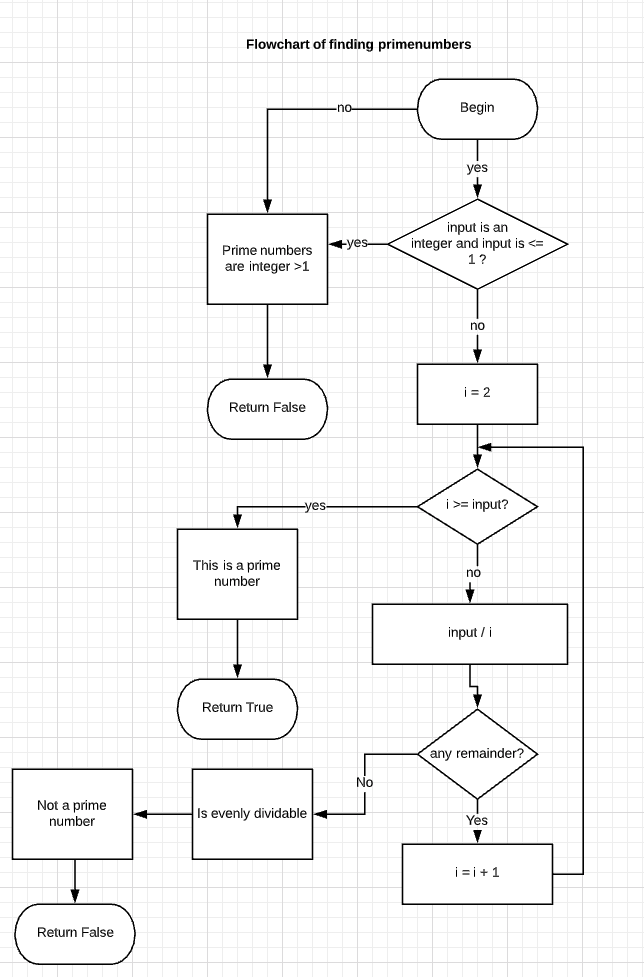
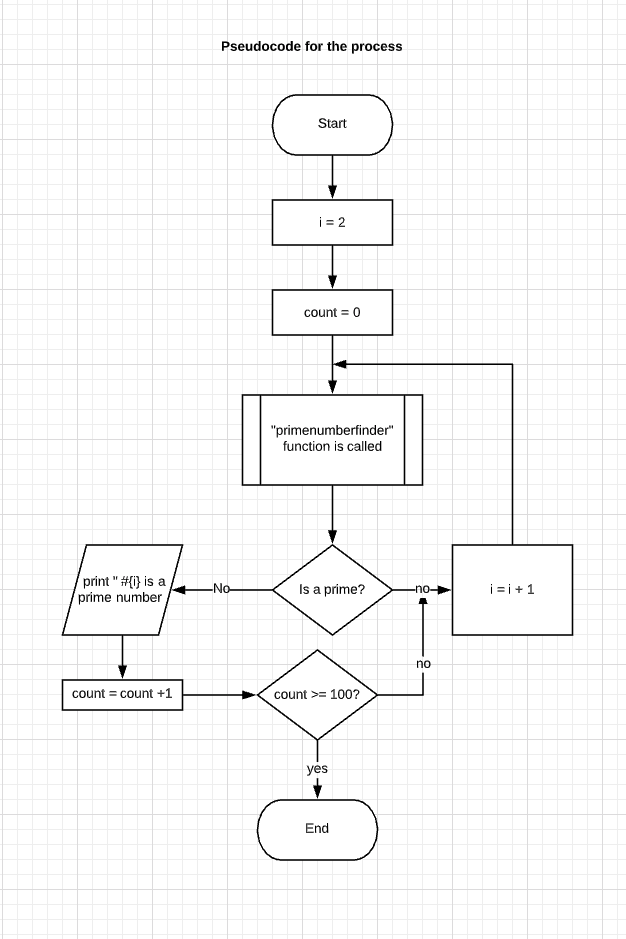
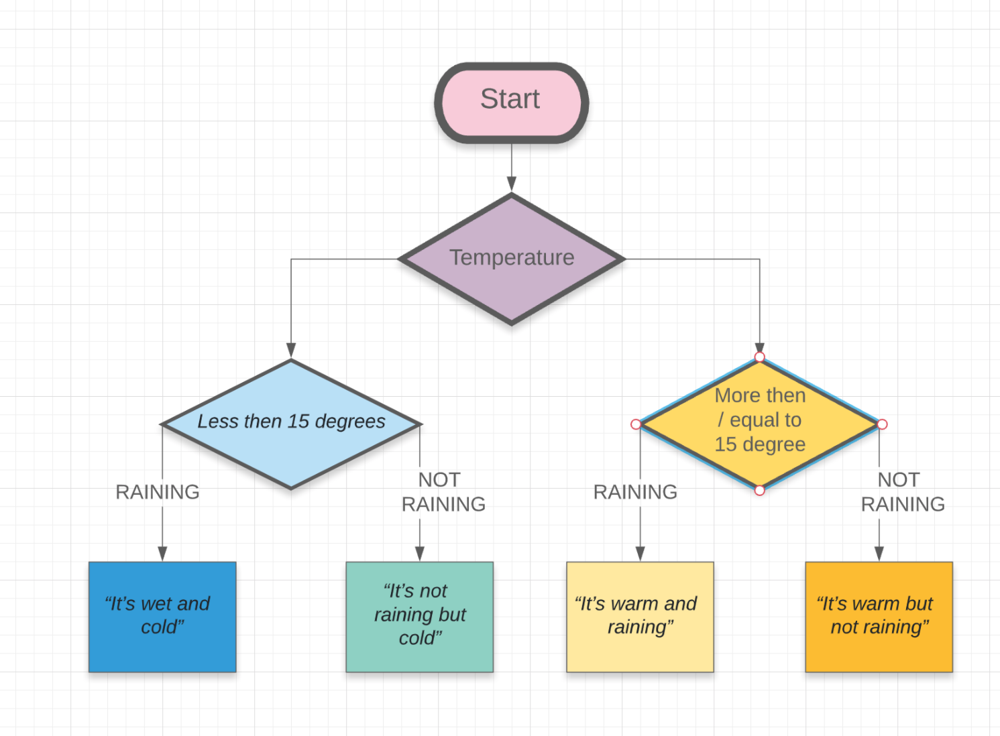

> # T1A1 - Workbook
## Q1: Research the development of the internet from 1980 to today. You must describe at least FIVE key events in the development of the internet. You can refer to events, people of significance, or technologies and how they have changed over time.❓

### ❇ Ans:


#### 1. 1985 - DNS:
>  The Domain Name System (DNS) is a naming system for computers, services, or other resources connected to the Internet or a private network. It associates various information with domain names assigned to each of the participating entities. it translates more readily memorized domain names to the numerical IP addresses needed for locating and identifying computer services and devices with the underlying network protocols. By providing a worldwide, distributed directory service, the Domain Name System has been an essential component of the functionality of the Internet since 1985.The Domain Name System delegates the responsibility of assigning domain names and mapping those names to Internet resources by designating authoritative name servers for each domain. Network administrators may delegate authority over sub-domains of their allocated name space to other name servers. This mechanism provides distributed and fault-tolerant service and was designed to avoid a single large central database

[DNS info link](https://en.wikipedia.org/wiki/Domain_Name_System#History)


#### 2. 1989 - WWW:
> The World Wide Web (WWW), as known as the Web,  invented by English scientist Tim Berners-Leethe in 1989 is an information system that identifies documents and other web resources are by URLs, interlinked by hypertext, and is accessible over the Internet. The resources of the WWW are transferred via the Hypertext Transfer Protocol (HTTP) and accessed by users by a software application called a web browser and are published by a software application called a web server.
. Tim Berners-Leethe wrote the first web browser in 1990 while employed at CERN near Geneva, Switzerland. It was released outside CERN in 1991, first to other research institutions starting in January 1991 and then to the general public in August 1991. The World Wide Web has been central to the development of the Information Age and is the primary tool billions of people use to interact on the Internet.

[WWW info link](https://en.wikipedia.org/wiki/World_Wide_Web)


#### 3. 1971 - Email:

> Ray Tomlinson is credited as the inventor of email; in 1971 who developed the first system able to send mail between users on different hosts across the ARPANET, using the @ sign to link the user name with a destination server.
Email operates across computer networks, primarily the Internet. Today's email systems are based on a store-and-forward model. Email servers accept, forward, deliver, and store messages. Neither the users nor their computers are required to be online simultaneously; they need to connect, typically to a mail server or a webmail interface to send or receive messages or download it.
Originally an ASCII text-only communications medium, Internet email was extended by Multipurpose Internet Mail Extensions (MIME) to carry text in other character sets and multimedia content attachments. International email, with internationalized email addresses using UTF-8, is standardized but not widely adopted.

[Email info link](https://en.wikipedia.org/wiki/Email)

#### 4. 2005 - Youtube:

> YouTube is an American online video-sharing platform created by three former PayPal employees-Chad Hurley, Steve Chen, and Jawed Karim in February 2005. Google bought the site in November 2006 for US$1.65 billion; YouTube now operates as one of Google's subsidiaries. YouTube allows users to upload, view, rate, share, add to playlists, report, comment on videos, and subscribe to other users. It offers a wide variety of user-generated and corporate media videos. Most content on YouTube is uploaded by individuals, but media corporations including CBS, the BBC, Vevo, and Hulu offer some of their material via YouTube as part of the YouTube partnership program. Unregistered users can only watch (but not upload) videos on the site, while registered users are also permitted to upload an unlimited number of videos and add comments to videos.

[Youtube info link](https://en.wikipedia.org/wiki/YouTube)

#### 5. 1995 - Internet phone:

>  Almost a decade before Skype released its first client, an Israeli company called VocalTec released Internet Phone, which is regarded as the first commercial VoIP application for desktop computers. We were all rocking dial-up modems at this point, but the software's ability to deal with slow connections and Internet packet loss helped it pave the way for VoIP to hit the mainstream.


[Internet phone info](https://www.cnet.com/news/the-50-most-significant-moments-of-internet-history/)


---
## Q2:Define the features of the following technologies that are essential in terms of the development of the internet:
  - packets
  - IP addresses (IPv4 and IPv6)
  - routers and routing
  - domains and DNS

Explain how each technology has contributed to the development of the internet.❓
 
  
### ❇ Ans:

#### * packets:
A packet is a formatted unit of data carried by a packet-switched network. A packet consists of control information and user data, which is also known as the payload. The control information provides data for delivering the payload, for example, source and destination network addresses, error detection codes, and sequencing information. Typically, control information is found in packet headers and trailers.

In packet switching, the bandwidth of the communication medium is shared between multiple communication sessions, in contrast to circuit switching, in which circuits are preallocated for the duration of one session, and data is typically transmitted as a continuous bitstream.
[source](https://en.wikipedia.org/wiki/Network_packet)

#### * IP addresses: 
The numerical label assigned to each device connected to a computer network that uses the Internet Protocol for communication is called an  Internet Protocol address (IP address). It has two functions: host or network interface identification and location addressing.
The IP address has the size of a 32-bit number is IPv4. However, because of the growth of the Internet and the depletion of available IPv4 addresses, a new version of IP (IPv6), using 128 bits for the IP address, was standardized in 1998. IPv6 deployment has been ongoing since the mid-2000s.IP addresses are written and displayed in human-readable notations. The size of the routing prefix of the address is designated in CIDR notation by suffixing the address with the number of significant bits.

#### * Routers and routing
A networking device that forwards data packets between computer networks is called the router which performs the traffic directing functions on the Internet. Data sent through the internet, such as a web page or email, is in the form of data packets which is typically forwarded from one router to another router through the networks that constitute an internetwork until it reaches its destination node.

A router is connected to two or more data lines from different IP networks. When a data packet comes in on one of the lines, the router reads the network address information in the packet header to determine the ultimate destination. Then, using the information in its routing table or routing policy, it directs the packet to the next network on its journey.

The most familiar type of IP routers is home and small office routers that simply forward IP packets between the home computers and the Internet. An example of a router would be the owner's cable or DSL router, which connects to the Internet through an Internet service provider (ISP). More sophisticated routers, such as enterprise routers, connect large business or ISP networks up to the powerful core routers that forward data at high speed along the optical fiber lines of the Internet backbone.
[source](https://en.wikipedia.org/wiki/Router_(computing))

The process of selecting a path for traffic in a network is called routing. Broadly, routing is performed in many types of networks, including circuit-switched networks, such as the public switched telephone network (PSTN), and computer networks, such as the Internet.

In packet switching networks, routing is the higher-level decision making that directs network packets from their source toward their destination through intermediate network nodes by specific packet forwarding mechanisms. Packet forwarding is the transit of network packets from one network interface to another. Intermediate nodes are typically networked hardware devices such as routers, gateways, firewalls, or switches. General-purpose computers also forward packets and perform routing, although they have no specially optimized hardware for the task.

The routing process usually directs forwarding on the basis of routing tables. Routing tables maintain a record of the routes to various network destinations. Routing tables may be specified by an administrator, learned by observing network traffic or built with the assistance of routing protocols.
[source](hhttps://en.wikipedia.org/wiki/Routing)

#### * Domains and DNS 
The Domain Name System (DNS) is a  naming system for computers, services, or other resources connected to the Internet or a private network. It associates various information with domain names assigned to each of the participating entities. Most prominently, it translates more readily memorized domain names to the numerical IP addresses needed for locating and identifying computer services and devices with the underlying network protocols. By providing a worldwide, distributed directory service, the Domain Name System has been an essential component of the functionality of the Internet since 1985. The Domain Name System delegates the responsibility of assigning domain names and mapping those names to Internet resources by designating authoritative name servers for each domain. Network administrators may delegate authority over sub-domains of their allocated name space to other name servers. This mechanism provides a distributed and fault-tolerant service and was designed to avoid a single large central database.

The Domain Name System also specifies the technical functionality of the database service that is at its core. It defines the DNS protocol, a detailed specification of the data structures, and data communication exchanges used in the DNS, as part of the Internet Protocol Suite.
[source](https://en.wikipedia.org/wiki/Domain_Name_System)

---  
## Q3: Define the features of the following technologies that are essential in terms of the development of the internet:
  - TCP
  - HTTP and HTTPS
  - web browsers (requests, rendering and developer tools)

Explain how each technology has contributed to the development of client and server communication over the internet ❓: 

#### * TCP:
The Transmission Control Protocol (TCP) is one of the main protocols of the Internet protocol suite that originated in the initial network implementation in which it complemented the Internet Protocol (IP). The entire suite is commonly referred to as TCP/IP. TCP provides reliable, ordered, and error-checked delivery of a stream of octets (bytes) between applications running on hosts communicating via an IP network. Major internet applications such as the World Wide Web, email, remote administration, and file transfer rely on TCP, which is part of the Transport Layer of the TCP/IP suite. SSL/TLS often runs on top of TCP.

TCP is connection-oriented, and a connection between client and server is established (passive open) before data can be sent. Three-way handshake (active open), retransmission, and error-detection adds to reliability but lengthens latency. Applications that do not require reliable data stream service may use the User Datagram Protocol (UDP), which provides a connectionless datagram service that prioritizes time over reliability. TCP employs network congestion avoidance. However, there are vulnerabilities to TCP including denial of service, connection hijacking, TCP veto, and reset attack. For network security, monitoring, and debugging, TCP traffic can be intercepted and logged with a packet sniffer.
[source](https://en.wikipedia.org/wiki/Transmission_Control_Protocol)

#### * HTTP AND HTTPS
The Hypertext Transfer Protocol (HTTP) is an application protocol for distributed, collaborative, hypermedia information systems. HTTP is the foundation of data communication for the World Wide Web, where hypertext documents include hyperlinks to other resources that the user can easily access, for example by a mouse click or by tapping the screen in a web browser.

Hypertext Transfer Protocol Secure (HTTPS) is an extension of the Hypertext Transfer Protocol (HTTP). It is used for secure communication over a computer network and is widely used on the Internet. In HTTPS, the communication protocol is encrypted using Transport Layer Security (TLS) or, formerly, its predecessor, Secure Sockets Layer (SSL). The protocol is therefore also referred to as HTTP over TLS, or HTTP over SSL.

The principal motivations for HTTPS are authentication of the accessed website, and protection of the privacy and integrity of the exchanged data while in transit. It protects against man-in-the-middle attacks, and the bidirectional encryption of communications between a client and server protects the communications against eavesdropping and tampering. In practice, this provides a reasonable assurance that one is communicating with the intended website without interference from attackers.
[source](https://en.wikipedia.org/wiki/Hypertext_Transfer_Protocol)
[source](https://en.wikipedia.org/wiki/HTTPS)

#### * web browsers:
A web browser (commonly referred to as a browser) is a software application for accessing the information on the World Wide Web. When a user requests a web page from a particular website, the web browser retrieves the necessary content from a web server and then displays the resulting web page on the screen. The purpose of a web browser is to fetch information resources from the Web and display them on a user's device.

This process begins when the user inputs a Uniform Resource Locator (URL), such as https://en.wikipedia.org/, into the browser. Virtually all URLs on the Web start with either HTTP: or https: which means the browser will retrieve them with the Hypertext Transfer Protocol (HTTP). In the case of https: the communication between the browser and the webserver is encrypted for the purposes of security and privacy.Once a web page has been retrieved, the browser's rendering engine displays it on the user's device. This includes image and video formats supported by the browser.
[source](https://en.wikipedia.org/wiki/Web_browser)

---  
 ## Q4:Identify THREE data structures used in the Ruby programming language and explain the reasons for using each.❓
 ❇ Three Data structures Used in Ruby Programming are:
  - **Array**: An array is a collection that stores a list of values. It can store all kinds of items in a specific order unless something is done to change the order. The most useful function of an array is retrieving an element by the way of referring to its position. Setting a new element to a position or overwriting is another useful act of an array. 
  ***info link*** ➡️ [Array](http://ruby-for-beginners.rubymonstas.org/built_in_classes/arrays.html)
  - **Hash**: A useful form of storing objects similar to a dictionary where values are signed to keys so that values can be looked up by their key. Looking up a value by the key is one big function of hash. Two hashes can be merged by using `.merge` method and the value can be retrieved later by using `.fetch` method.
   ***info link*** ➡️ [Hash](http://ruby-for-beginners.rubymonstas.org/built_in_classes/hashes.html)
  - **Binary trees**: The binary tree is an advanced level data structure of ruby that contains two child nods that may include references to their parents.
   ***info link*** ➡️ [Binary tree](https://www.techopedia.com/definition/1145/binary-tree)
 
 
 ---
 ## Q5:  Describe the features of interpreters and compilers and how they are different.❓
### ❇ Ans:
### Interpreter:
* Interpreter translates one statement at a time analizing the sourcecode faster. The code execution time is slower. No intermediate object code is generated. This is more memory efficience. Debugging is easier in interpriter.
##### The example of Interpriter is Ruby, Python.

### Compiler:
* Compiler scans the entire program before transleting the whole into machine code and it analize the sourcecode slower then interpriter. The code execution time is faster. Intermediate object code is generated. This needs more memory. Debugging is harder in compiler.
##### The example of Interpriter is C, C++, Java ☕.


➡️ [Source link for difference of interpreter and compiler ](https://www.programiz.com/article/difference-compiler-interpreter)


 ---
 ## Q6:  TWO commonly used programming languages and explain the benefits and drawbacks of each.❓
 ### ❇ Ans:
 
 TWO commonly used programming languages:
 1.  Ruby
2.  Java 
 
 Ruby:
 - Dynamicly typed  language
 - Interpreted language
 - `require` statement is used to import a package or a module
 - null value is declared with `nil`
 - In Ruby, everything is an object

Java:
- Staticly typed language
- Compiled language
-  `import` statement is used to load a package
-  null value is declared with `null`
-  In Java, only classes have objects

[Source link: Ruby, Java](https://www.developer.com/open/article.php/3716356/Java-vs-Ruby-a-Comparison-of-the-Key-Elements.htm)


 
 ---
 ## Q7: Identify TWO ethical issues from the areas below and discuss the extent to which an IT professional is ethically responsible in terms of the issue.

List of topics containing ethical issues:
  - access to a user’s personal information (medical, family, financial, personal attributes such as sexuality, religion, or beliefs)
  - intellectual property, copyright, and acknowledgement.
  - criminal acts such as theft, fraud, trafficking and distribution of prohibited substances, terrorism
  - GPS tracking data and other types of metadata, MAC addresses, hardware fingerprints
  - freedom of thought, conscience, speech and the media
  - aggressive sales and marketing practices designed to mislead and deceive consumers
  - trading of shares on the stock exchange OR crypto-currencies

For each ethical issue identify a source of legal information relating to the ethical issue and discuss whether the law is helpful in assisting a developer to act in an ethical way.

Conduct research into a case study of ONE of the ethical issues you have chosen discuss how an ethical IT professional should respond to the case study and how they might mitigate or prevent ethical breaches.❓
 ### ❇Ans:
 I think the following two issues are relevent to IT professionals.

Access to user's personal information ( medical, family, financial, personal attributes such as sexuality, religion, or beliefs)
  - Australian privacy laws are contained in a variety of Commonwealth, State and Territory Acts. The "Privacy Acts" are data protection laws which regulate the collection, use and disclosure of personal information about individuals; they do not protect privacy of the individual in a broader sense. Many companies follow this and encript data and arrange training for developer to handle personal data carefully so that an individual developer can not access it. So In my opinion, there are enough knowledge out there for a developer to help with make a ethical decession. 

GPS tracking data and other types of metadata, MAC address, hardware fingerprints.
  - Internet and other telecommunications services, ISPs and telephone service providers who mainly have access to user location, Mac address and hardware fingnerprints are also required to comply with the privacy protection provisions of the Telecommunications Act 1997 (C'th) and the Telecommunications (Interception) Act 1979 (C'th). A variety of other legislation contains privacy protection provisions relevant to particular types of entities and/or practices, for example, the Spam Act, surveillance and listening devices acts, and many others. Companies are pro active to follow this and encript data and arrange training for developer to handle personal data carefully so that an individual developer can not access it. So In my opinion, there are enough knowledge out there for a developer to help with make a ethical decession. 

Case Study: 

An investigation into Vodafone Hutchison Australia following allegations that customer information had been compromised showed that the company’s business model provided access to the company’s databases of customer information to dealership employees via a shared store login ID.

Although the use of shared logins and the wide availability of full identity information is an inherent personal information security risk, in this instance the risk was increased by the fact that the entity had less control over information being accessed through dealerships, and no way of tracking or auditing who was accessing the information.

To prevent this IT professional could flag that issue when building the feature and could suggest instead of showing the information without individuals permission, it could ask permisson from user weather they want to show their information on different dealership stores.
[resource1](https://www.oaic.gov.au/privacy/privacy-decisions/investigation-reports/vodafone-hutchison-australia-own-motion-investigation-report/)
[resource2](https://www.efa.org.au/Issues/Privacy/privacy.html)


 ---
 ## Q8:Explain control flow, using an example from the Ruby programming language❓
### ❇ Ans:

Control flow is the order in which individual function calls of a program are exicuted.The control flow distinguishes an imperative programming language from a declarative programming language.

Within an imperative programming language, a control flow statement is a statement that results in a choice being made as to which of two or more paths to follow. For non-strict functional languages, functions and language constructs exist to achieve the same result, but they are usually not termed control flow statements.
 
 
 
 
 --- 
 ## Q9:  Explain type coercion❓
 ### ❇ Ans:
 
 Type coercion is the automatic or implicit conversion of values from one data type to another (such as strings to numbers).  An example would be the conversion of an integer value into a floating-point value or its textual representation as a string, and vice versa. Each programming language has its own rules on how types can be converted. Languages with strong typing typically do a little implicit conversion and discourage the reinterpretation of representations, while languages with weak typing perform many implicit conversions between data types. Weak typing language often allows forcing the compiler to arbitrarily interpret a data item as having different representations—this can be a non-obvious programming error or a technical method to directly deal with the underlying hardware.
 [source](https://en.wikipedia.org/wiki/Type_conversion)
 
 ---
 ## Q10: Describe the data types recognised by the Ruby programming language. In your description you should give example code which uses each data type, and include the name of the Ruby classes which represent each data type. ❓
 ### ❇ Ans:
 
 The data types recognised by the Ruby programming language are:
* **Booleans**

 In Ruby, a boolean refers to a value of either true or false of their very own data types. Every appearance of truth in a Ruby program is an instance of TrueClass, while every appearance of false is an instance of FalseClass. There are three main boolean operators in ruby: 
* ! ("single-bang") representing "NOT",  for example: !true #=> false
* && ("double-ampersand") representing "AND", for example: true && true #=> true
* || ("double-pipe") representing "OR". 

To check if two values are equal, we use the comparison operator represented with == ("double-equal-sign"). If two values are equal, then the statement will return true. If they are not equal, then it will return false.

[source](https://learn.co/lessons/booleans-ruby-readme)

* **Symbols**

A symbol looks like a variable name prefixed with a colon. Ruby uses symbols and maintains a Symbol Table to hold them. Symbols are names - names of instance variables, names of methods, names of classes. So if there is a method called control_movie, there is automatically a symbol :control_movie. Ruby's interpreted, so it keeps its Symbol Table handy at all times. You can find out what's on it at any given moment by calling Symbol.all_symbols.
We can also transform a String into a Symbol and vice-versa:

`puts "string".to_sym.class # Symbol  `
`puts :symbol.to_s.class    # String `

* **Numbers**

Ruby integers are objects of class Fixnum or Bignum. The Fixnum and Bignum classes represent integers of differing sizes. Both classes descend from Integer (and therefore Numeric). The floating-point numbers are objects of class Float, corresponding to the native architecture's double data type.
[source](http://rubylearning.com/satishtalim/numbers_in_ruby.html)

* **Strings**

A string is a sequence of a bunch of characters that may consist of letters, numbers, or symbols.
In Ruby, strings are objects, which are mutable, which means they can be changed in place instead of creating new strings. 
For printing a string the bunch of characters is written  like this
print "This is a string."
or, puts "This is a string which will make a line break at the end."
[source](https://www.digitalocean.com/community/tutorials/how-to-work-with-strings-in-ruby)

* **Arrays**

Arrays are like bags that contain things in order which can be multidimensional. Counting on array starts with zero index, which means the first item in array is index zero, the next one is index one. It is Array class object. 
words = ["one", "two", "three"]
puts words[0] => one
[source](http://ruby-for-beginners.rubymonstas.org/built_in_classes/arrays.html)

* **Hashes**
 
 A Hash assigns values to keys so that values can be looked up by their key like a dictionary. In Ruby you can create a Hash by assigning a key to a value with =>, separate these key/value pairs with commas and enclose the whole thing with curly braces. The class of this type of object is the Hash class.
This is how it looks:
{ "one" => "a", "two" => "b", "three" => "c" }
[source](http://ruby-for-beginners.rubymonstas.org/built_in_classes/hashes.html)
 
 ---
 ##  Q11: Here’s the problem: “There is a restaurant serving a variety of food. The customers want to be able to buy food of their choice. All the staff just quit, how can you build an app to replace them?”
  - Identify the classes you would use to solve the problem
  - Write a short explanation of why you would use the classes you have identified ❓
 ### ❇Ans:
 
 #### Classes:
 
 ##### 1. Menu :
 ###### Explanation:
 Menu class wil hold the name of foods with asigned price of it so the customer can choose their food from the menu with the knowledge of price.
 ##### 2.Customer: 
 ###### Explanation:
 Customer class will hold the details of each customer like, allargic alert, religous food choice, name, address, phone number so their favorite menu item could be saved for later.
 ##### 3.Food:
 ###### Explanation:
 Food class will hold description about food.Like the allergic ingredients alert, whole ingredients with the nutritional value of the item.
##### 4.Orderlist: 
###### Explanation:
Explanation class is here to hold chossen menu and sum up the bill for next time history showing and payment issue.
##### 5.Ordertaker: 
###### Explanation:
Ordertaker class takes order list to chef for preparing the food item.
##### 6.Foodmaker:
###### Explanation: 
Foodserver will cook the food.
##### 7.Foodserver: 
###### Explanation:
 Foodmakre will serve the prepared food to the customer.
##### 8.Paymentaker: 
###### Explanation:
Paymenttaker takes the bill and gives change if required.


 ##  Q12: Identify and explain the error in the following code that is preventing correct execution of the program❓    
     celsius = gets
     fahrenheit = (celsius * 9 / 5) + 32
     print "The result is: "
     print fahrenheit
     puts "."
     
     
     
 ### ❇ Ans: 
 
 Here, `Celsius` is storing a string as an input which can not be coerced into integer. The stored input needs to convert into integer.
 The correct code is
  ` celsius = gets.to_f`
    `print "The result is: "`
    `fahrenheit = (celsius * 9 / 5) + 32`
    `print fahrenheit`
    `puts '.'`
   
  
 
 ---
 ## Q13: The following code looks for the first two elements that are out of order and swaps them; however, it is not producing the correct results. Rewrite the code so that it works correctly. ❓
 ### ❇ Ans:
 
 `arr = [5, 22, 29, 39, 19, 51, 78, 96, 84]`
 `i = 0`
 `while (i < arr.size - 1 and arr[i] < arr[i + 1])`
  `i = i + 1 end`
 `puts i`
 `item = arr[i]`
 `arr[i] = arr[i + 1]`
 `arr[i + 1] = item`
 

 ## Q14: Demonstrate your algorithmic thinking through completing the following two tasks, in order:
  i. Create a flowchart to outline the steps for listing all prime numbers between 1 and 100 (inclusive). Your flowchart should make use of standard conventions for flowcharts to indicate processes, tasks, actions, or operations  
ii. Write pseudocode for the process outlined in your flowchart ❓
 ### ❇ Ans:
 
 #### FLOWCHART:
 
 
 #### PSEUDOCODE:
 


 [link for flowchart and pseudocode lucide chart](https://app.lucidchart.com/invitations/accept/283c6561-83f8-4653-b1ef-3b14de066693)
 
 ---
 ## Q15:Write pseudocode OR Ruby code for the following problem:

You have access to two variables: raining (boolean) and temperature (integer). If it’s raining and the temperature is less than 15 degrees, print to the screen “It’s wet and cold”, if it is less than 15 but not raining print “It’s not raining but cold”. If it’s greater than or equal to 15 but not raining print “It’s warm but not raining”, and otherwise tell them “It’s warm and raining”.	❓
 ### ❇ Ans:
 
 
 ## [Lucidchart](https://www.lucidchart.com/invitations/accept/7a0f12fe-8cbf-4b18-a40c-94c68e72ad3e)
---

 ## Q16: Write a program that, given a person’s score can tell them:
  ## a. whether or not they’re allergic to a given item❓
  ## b. the full list of allergies❓
 ### ❇ Ans:
 ```
 class Allergy
  ALLERGIC_ITEMS = ['eggs', 'peanuts', 'shellfish', 'strawberries', 'tomatoes', 'chocolate', 'pollen', 'cats']
  attr_reader :score
  def initialize(score)
    @score = score
  end
  def reversed_binary
    score.to_s(2).split("").reverse
  end

  def allergen_list
    identified_alleregen = []
    reversed_binary.each_with_index do |binary, index|
        if binary == '1'
          identified_alleregen << ALLERGIC_ITEMS[index]
        end
    end
    identified_alleregen
  end

  def is_allergic?(name)
    allergen_list.include?(name) ? true : false
  end

end

 ```

[github link of solution ](https://github.com/ismatfarjana/T1A1-WORKBOOK/blob/master/allergies.rb)